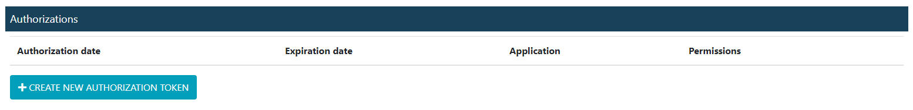
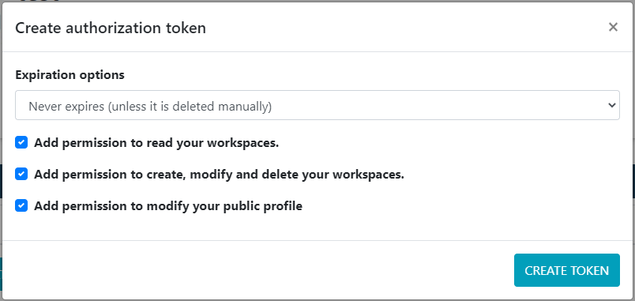
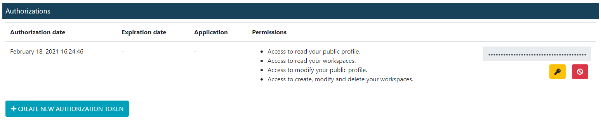

Authentication
==============

This package interacts with `Deep Intelligence API <https://app.deepint.net/api/v1/documentation/>`_. Therefore, it is necessary to provide a token in the header of each transaction, which must be provided to this package in order to operate. 
This section discusses how to provide such a token to the package in the various ways in which it is offered.

How to setup credentials
------------------------

Credentials can be set up with one of the following methods (the token is loaded in the priority defined in the order of the following items):
 - instance credentials object with the token and instance optional parameters `c = Credentials(token='a token', instance='app.deepint.net')`
 - create a environment variable called `DEEPINT_TOKEN` with the token value and another one called `DEEPINT_INSTANCE`.
 - create a .ini file in your home directory called `.deepint` coninting in the `DEFAULT` section the key `token` and the key `instance` like in following example

.. code-block::
   :caption: ~/.deepint.ini

	[DEFAULT]
	token=a token
   instance=host to connect with (if not providen app.deepint.net will be taken by default)

Note: If instance is not providen, the default value will be the SaaS instance `app.deepint.net`.

How to obtain a token
---------------------

In order to interact with the Deep Intelligence API, it is necessary to obtain a token that is attached to each request. To do this, first, you must log in, after which you must go to the `account configuration page <https://app.deepint.net/workspace?ws=&s=account>`_  and go to the "Authorizations" section. There you must click on the "Create new authorization token" button as shown in the image below:

After that, a modal will appear, where you can configure the permissions and expiration of the token:

Finally, by pressing the key button as shown in the image below, the token is obtained:

It is important to highlight that the token is associated to the user and not to the organization, which means that the same token can be used to access multiple organizations.

How to set a on-premise instance
--------------------------------

If you are using a on-premise instance of Deep Intelligence, it's neccesary to setup the instance parameter in one of the following ways
 - provide the host or IP of the on-premise instance when instancing the credentials or using the `Credentials.build` method `c = Credentials(token='a token', instance='app.deepint.net')`
 - create a environment variable called `DEEPINT_INSTANCE` with the host or IP of the on-premise instance.
 - create a .ini file in your home directory called `.deepint` coninting in the `DEFAULT` section the key `instance` with the host or IP of the on-premise instance.