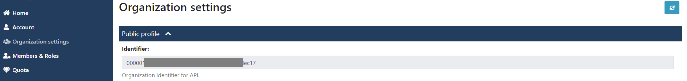

Authentication
==============

This package interacts with `Deep Intelligence API <https://app.deepint.net/api/v1/documentation/>`_. Therefore, it is necessary to provide a token in the header of each transaction, which must be provided to this package in order to operate. 
This section discusses how to provide such a token to the package in the various ways in which it is offered.

How to setup credentials
------------------------

Credentials can be set up with one of the following methods (the token is loaded in the priority defined in the order of the following items):
 - instance credentials object with the token optional parameter `c = Credentials(token='a token', organization='your organization id')`
 - create a environment variable called `DEEPINT_TOKEN` with the token value and an enviroment variable called `DEEPINT_ORGANIZATION`.
 - create a .ini file in your home directory called `.deepint` coninting in the `DEFAULT` section the keys called `token` and `organization` like in following example

.. code-block::
   :caption: ~/.deepint.ini

	[DEFAULT]
	token=a token
   organization=a organziation

How to obtain a token
---------------------

In order to interact with the Deep Intelligence API, it is necessary to obtain a token that is attached to each request. To do this, first, you must log in, after which you must go to the `account configuration page <https://app.deepint.net/workspace?ws=&s=account>`_  and go to the "Authorizations" section. There you must click on the "Create new authorization token" button as shown in the image below:

.. image:: ../../static/images/obtain_token_step_1.PNG
   :width: 600

After that, a modal will appear, where you can configure the permissions and expiration of the token:

.. image:: ../../static/images/obtain_token_step_2.PNG
   :width: 600

Finally, by pressing the key button as shown in the image below, the token is obtained:

.. image:: ../../static/images/obtain_token_step_3.PNG
   :width: 600

It is important to highlight that the token is associated to the user and not to the organization, which means that the same token can be used to access multiple organizations.

How to obtain the organization id
---------------------------------

In order to operate with Deep Intelligence workspaces, it is neccesary to provide the organization identifier. To obtain that identifier, you must go to the organization settings page, that you can find in the left bar.

